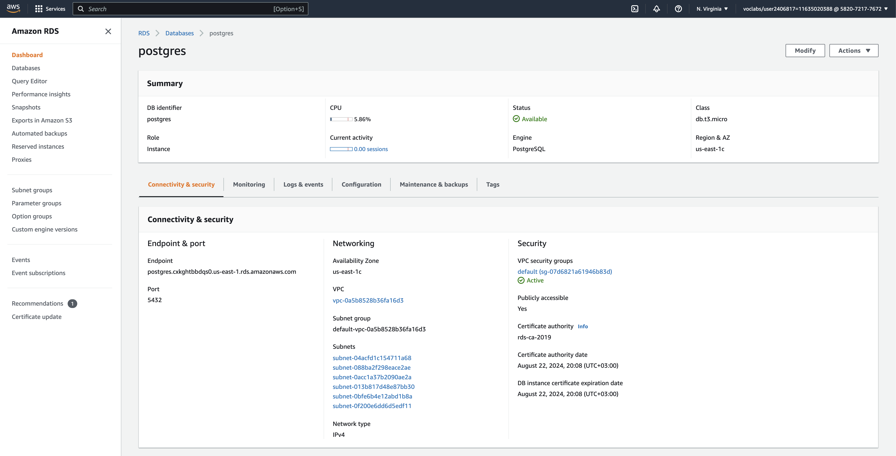
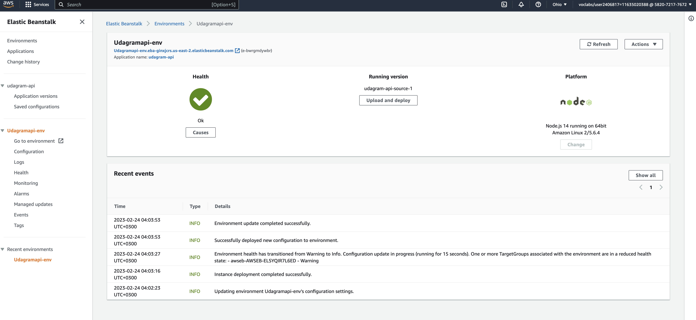
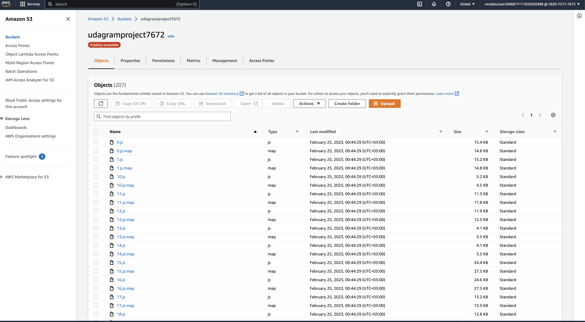
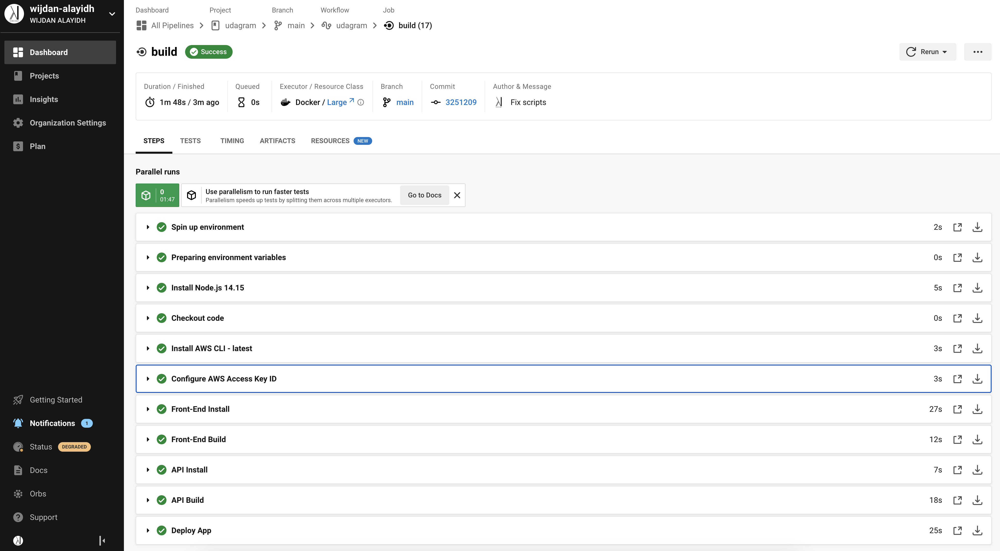
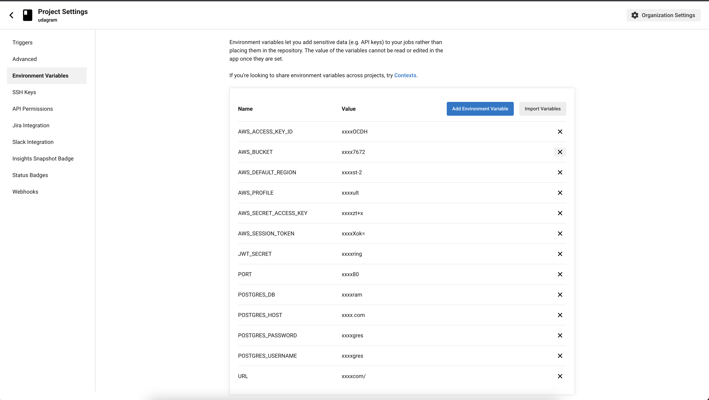

# Hosting a Full-Stack Application

This sample project was used as a capstone project from the Full-Stack Javascript nanodegree from udacity, the main goal of this project is to use this sample application to deploy it at AWS hosting services.

 

## Application Link

---

 

You can find the project at this link:

http://udagramproject7672.s3-website.us-east-2.amazonaws.com/

 

## Deployment Process Screenshots

---

 

### 1- AWS RDS for the database

 

 

### 2 - AWS ElasticBeanstalk

 

 

### 3 - AWS s3

 

 

### 4 - Circleci Pipline

 

 

### 5 - Enviroument Variables

 

 

## Infrastructure

---

 

Infrastructure details are listed on the following page : [Infrastructure page](./documentation/Infrastructure.md)

 

## Pipeline Process

---

 

Pipeline Process details are listed on the following page : [Pipeline Process page](./documentation/Pipeline.md)

 

## Project Dependencies

---

 

Project Dependencies details are listed on the following page : [Project Dependencies page](./documentation/Dependencies.md)

 

## License

---

 

[License](LICENSE.txt)
