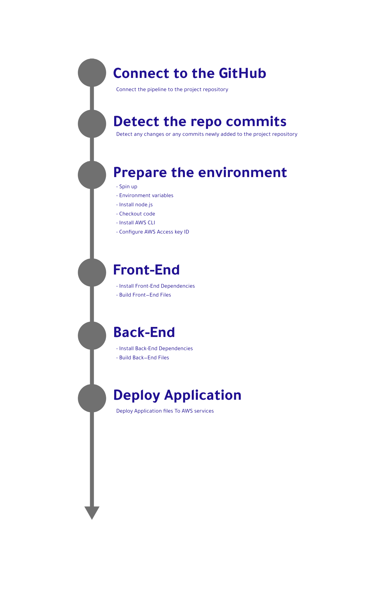

# Pipeline process

 

## Process Description

---

 

Steps of transfer the project files from the GitHub repository to AWS services using circleci pipeline:

    1 - Connect the pipeline to the project repository on github.
    2 - The Pipeline will detect any changes or committed added to the repository to start building the application and deploy the changes to the AWS services.
    3 - After detecting the changes in the repository the pipeline will prepare the environment, and this includes:
        - Spin up
        - Prepare environment variables
        - install node.js
        - Checkout code
        - Install AWS CLI
        - Configure AWS Access Key ID
    4 - Preparing the Front-End Environment by installing the front-end dependencies and building files to prepare Environment for the deployment process.
    5 - Preparing the Back-End Environment by installing the front-end dependencies and building files to prepare Environment for the deployment process.
    6 - After Preparing the project files the pipeline will deploy the files to The AWS services based on the settings listed in the pipeline

 

## Process Schema

---

 

